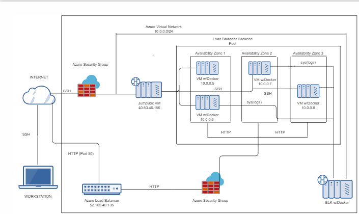
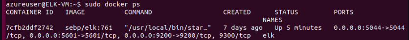

## Automated ELK Stack Deployment
## CINDY's README
The files in this repository were used to configure the network depicted below.

 


Playbook File

- name: Config elk VM with Docker
  hosts: elk
  remote_user: cdieng
  become: true
  tasks:

  - name: Install docker.io
    apt:
      force_apt_get: yes
      update_cache: yes
      name: docker.io
      state: present

  - name: Install pip3
    apt:
      force_apt_get: yes
      name: python3-pip
      state: present

  - name: Install Docker python module
    pip:
      name: docker
      state: present

  - name: Increase virtual memory
    command: sysctl -w vm.max_map_count=262144

  - name: use more memory
    sysctl:
      name: vm.max_map_count
      value: 262144
      state: present
      reload: yes

  - name: download and launch a docker elk container
    docker_container:
      name: elk
      image: sebp/elk:761
      state: started
      restart_policy: always
      published_ports:
          - 5601:5601
          - 9200:9200
          - 5044:5044 

  - name: Enable docker service
    systemd:
      name: docker
      enabled: yes

This document contains the following details:
- Description of the Topology
- Access Policies
- ELK Configuration
  - Beats in Use
  - Machines Being Monitored
- How to Use the Ansible Build


### Description of the Topology

The main purpose of this network is to expose a load-balanced and monitored instance of DVWA, the D*mn Vulnerable Web Application.

Load balancing ensures that the application will be highly *available*, in addition to restricting *inbound access* to the network. The load balancer ensures that work to process incoming traffic will be shared by both vulnerable web servers. Access controls will ensure that only authorized users — namely, ourselves — will be able to connect in the first place.

Integrating an ELK server allows users to easily monitor the vulnerable VMs for changes to the *file systems of the VMs on the network*, as well as watch *system metrics*, such as CPU usage; attempted SSH logins; `sudo` escalation failures; etc.

The configuration details of each machine may be found below.


| Name     | Function | IP Address | Operating System |
|----------|----------|------------|------------------|
| Jump Box | Gateway  | 10.0.0.4   | Linux            |
| Web1     | Server   | 10.0.0.5   | Linux            |
| Web2     | Server   | 10.0.0.6   | Linux            |
| Web3     | Server   | 10.0.0.7   | Linux            |

### Access Policies

The machines on the internal network are not exposed to the public Internet. 


Only the **jump box** machine can accept connections from the Internet. Access to this machine is only allowed from the IP address `100.15.155.113`


Machines _within_ the network can only be accessed by **each other**. The Web1 and Web2 VMs send traffic to the ELK server.
A summary of the access policies in place can be found in the table below.

| Name     | Publicly Accessible | Allowed IP Addresses |
|----------|---------------------|----------------------|
| Jump Box | Yes                 |   100.15.155.113     |
| ELK      | Yes                  |   100.15.155.113    |


### Elk Configuration

Ansible was used to automate configuration of the ELK machine. 

- What is the main advantage of automating configuration with Ansible?
to apply infrastructure as a code process in order to provision and manage the computing infrastructure as well as the machine-processable definition files configuration

The playbook implements the following tasks:
- Install docker 
- Install the python environment
- Intsall docker python module
- Downlaod and launch the Docker elk container
- Enable Docker service

The following screenshot displays the result of running `docker ps` after successfully configuring the ELK instance.



### Target Machines & Beats
This ELK server is configured to monitor the following machines:
the Web1 and Web2 VMs, at `10.0.0.5` and `10.0.0.6`, respectively.

We have installed the following Beats on these machines:

These Beats allow us to collect the following information from each machine:
- **Filebeat**: Filebeat detects changes to the filesystem. Specifically, we use it to collect Apache logs.
- **Metricbeat**: Metricbeat detects changes in system metrics, such as CPU usage. We use it to detect SSH login attempts, failed `sudo` escalations, and CPU/RAM statistics.
- **Packetbeat**: Packetbeat collects packets that pass through the NIC, similar to Wireshark. We use it to generate a trace of all activity that takes place on the network, in case later forensic analysis should be warranted.

### Using the Playbook
In order to use the playbooks, you will need to have an Ansible control node already configured. We use the **jump box** for this purpose.

To use the playbooks, we must perform the following steps:
- Copy the playbooks to the Ansible Control Node
- Run each playbook on the appropriate targets

The easiest way to copy the playbooks is to use Git:

```bash
$ cd /etc/ansible
$ mkdir files
# Clone Repository + IaC Files
$ git clone https://github.com/yourusername/project-1.git
# Move Playbooks and hosts file Into `/etc/ansible`
$ cp project-1/playbooks/* .
$ cp project-1/files/* ./files
```

This copies the playbook files to the correct place.

Next, you must create a `hosts` file to specify which VMs to run each playbook on. Run the commands below:

```bash
$ cd /etc/ansible
$ cat > hosts <<EOF
[webservers]
10.0.0.5
10.0.0.6

[elk]
10.0.0.8
EOF
```

After this, the commands below run the playbook:

 ```bash
 $ cd /etc/ansible
 $ ansible-playbook install_elk.yml elk
 $ ansible-playbook install_filebeat.yml webservers
 $ ansible-playbook install_metricbeat.yml webservers
 ```

To verify success, wait five minutes to give ELK time to start up. 

Then, run: `curl http://10.0.0.8:5601`. This is the address of Kibana. If the installation succeeded, this command should print HTML to the console.
